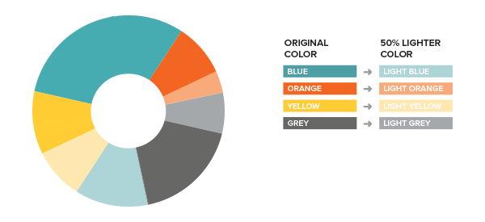

# Color Accessibility Converter

This Python script is designed to enhance color accessibility for individuals with color blindness. By utilizing the Python Imaging Library (PIL) for image processing, the script allows users to convert colors in an image, making it more distinguishable for those struggling with color vision deficiencies.

## Purpose

The primary goal of this application is to contribute to a more inclusive digital experience for individuals with color blindness. It addresses common challenges associated with color perception by providing a tool that adjusts color values in images, ensuring better visibility and comprehension for users with color vision deficiencies.

## Usage

1. **Run the Script:**
   - Open a terminal or command prompt.
   - Navigate to the directory containing the script:
     ```bash
     cd /path/to/script/directory
     ```
   - Run the script using Python 3:
     ```bash
     python3 color_converter.py
     ```

2. **Input Image:**
   - The script will prompt you to enter the path of the image file you want to process.
  

3. **Choose Color Blindness Type:**
   - Select the type of color blindness conversion:
     - 1: Deuteranomaly
     - 2: Protanopia
     - 3: Tritanopia
     - 4: Complete Color Blindness

4. **View Results:**
   - The script will generate and display a new image with the color values adjusted based on the selected color blindness type.

## Color Blindness Types

1. **Deuteranomaly:**
   - Unable to perceive green light. It is the most common type of color blindness, also known as red/green color blindness.
  

2. **Protanopia:**
   - No working red cones, making it impossible to see the color red. Orange, yellow, and green appear yellow.
  

3. **Tritanopia:**
   - Blue/yellow color blindness. No blue cone cells, making blue appear green and yellow look light gray or violet.
  

4. **Complete Color Blindness:**
   - The most rare type, where there is no color perception at all. The world appears in shades of gray, white, and black.
